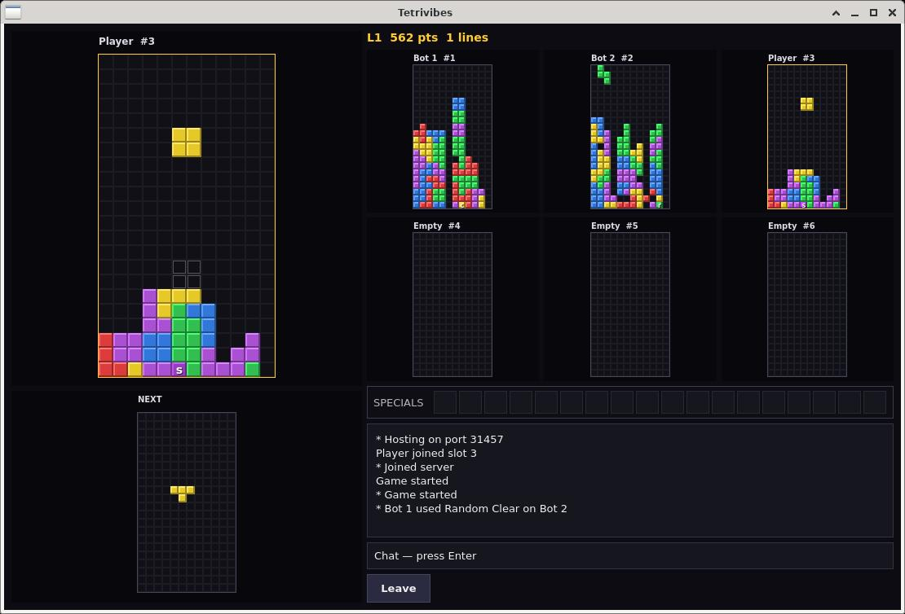

# Tetrivibes

Tetrivibes is a C++17 / Qt 5 client for multiplayer tetromino combat in the TetriNET style. It can join classic public servers and host its own matches on a native protocol.

The last player who can still place pieces wins.

This client was vibecoded with [OpenCode](https://opencode.ai) and Grok 4.6 — the best TetriNET client I ever played.

## Screenshots




## Features

### Classic TetriNET

- Connects to **TetriNET Classic** servers
- Supports protocol **version 1.13** (`tetrisstart … 1.13`)
- Supports **TetriFast**
- **Auto** protocol selection when joining from the lobby
- Partyline chat, channel list (`/list`, `/join`), topics, and winlists
- Classic 12×22 fields and special-block letters

### Server browser

- Public listing from [servers.tetrinet.fr](https://servers.tetrinet.fr/servers.xml)
- LAN discovery of native hosts (UDP port `31458`)
- Add, remove, and persist custom servers in `~/.tetrivibes/servers.csv`
- Saved nickname
- Blocktrix servers are shown as unsupported

### Hosted games (native)

- Host a local server (default TCP port `31457`) for up to six players
- Server-authoritative play: the host simulates fields, specials, and wins
- Optional practice bots (0–5) seated on unused slots
- Leave the match without stopping the server; return later or shut it down from the Host Game menu
- Matches stay in lobby until someone clicks **Start Game**
- Win scoreboard stored in `~/.tetrivibes/scoreboard.csv`

### Practice

- Offline match against 0–5 CPU opponents
- Same specials, inventory, and last-player-standing rules

### Playfield

- Ghost piece for hard-drop landing
- Next-piece preview
- Special inventory (up to 18)
- Keys `1`–`6` use the first special on that player slot

## Protocols

| Lobby option | Use |
| --- | --- |
| Auto | Prefer TetriNET 1.13 when joining a listed server |
| TetriNET 1.13 | Classic TetriNET login and framing (`0xFF` lines) |
| TetriFast | Faster drop timing on compatible servers |
| Native | Tetrivibes hosted games |

## Build

```bash
sudo apt install qtbase5-dev cmake g++
./build.sh
./build/tetrivibes
```

Or by hand:

```bash
cmake -S . -B build -DCMAKE_BUILD_TYPE=Release
cmake --build build -j
./build/tetrivibes
```

Run the test suite with `./test.sh`.

### Windows binary (cross-compile from Linux)

Install MinGW and a Windows MinGW build of Qt 5 (for example with [aqtinstall](https://github.com/miurahr/aqtinstall) into `~/qt/5.15.2/mingw81_64`):

```bash
sudo apt install g++-mingw-w64-x86-64 cmake
./build.sh --windows
```

The packaged exe and Qt DLLs are written to `build-win/dist/tetrivibes/`. Copy that folder to a Windows machine and run `tetrivibes.exe`.

If Qt is not in the default path:

```bash
QT_MINGW=/path/to/qt5-mingw ./build.sh --windows
```

`QT_MINGW` must contain `lib/cmake/Qt5`. Linux `qtbase5-dev` cannot be used for this build.

## Play

- **Join Server** — pick a listed, LAN, or custom host
- **Host Game** — start a native server and wait for friends, then **Start Game**
- **Practice vs Bots** — local match, no network

## Controls

| Key | Action |
| --- | --- |
| ← → | Move |
| ↑ / X | Rotate clockwise |
| Z / Ctrl | Rotate counter-clockwise |
| ↓ | Soft drop |
| Space | Hard drop |
| 1–6 | Use first special on that player slot |
| Enter | Focus chat |

## Specials

Clearing lines collects specials in those rows and plants more on your field.

| Letter | Name | Effect |
| --- | --- | --- |
| a | Add Line | Garbage line on the target |
| c | Clear Line | Remove the target's bottom line |
| b | Clear Specials | Turn target specials into normal blocks |
| r | Random Clear | Delete random blocks |
| o | Block Bomb | Explode bombs and scatter nearby blocks |
| q | Blockquake | Shift each row left/right |
| g | Gravity | Collapse columns and clear lines |
| s | Switch Field | Swap fields with the target |
| n | Nuke Field | Wipe the target's field |
| l | Left Gravity | Slide blocks to the left |
| p | Piece Change | Replace the current piece |
| z | Zebra Field | Clear every other column |

Helpful specials (`c`, `g`, `n`, `b`) are worth using on yourself. The rest are attacks.

## License

MIT. See [LICENSE](LICENSE).
